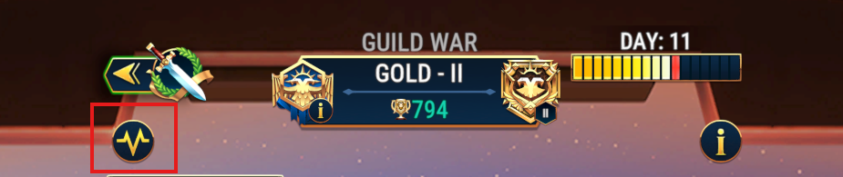
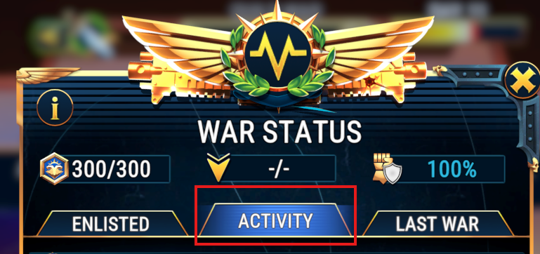
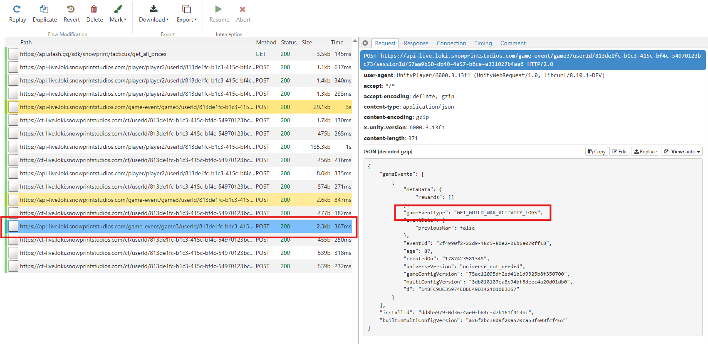
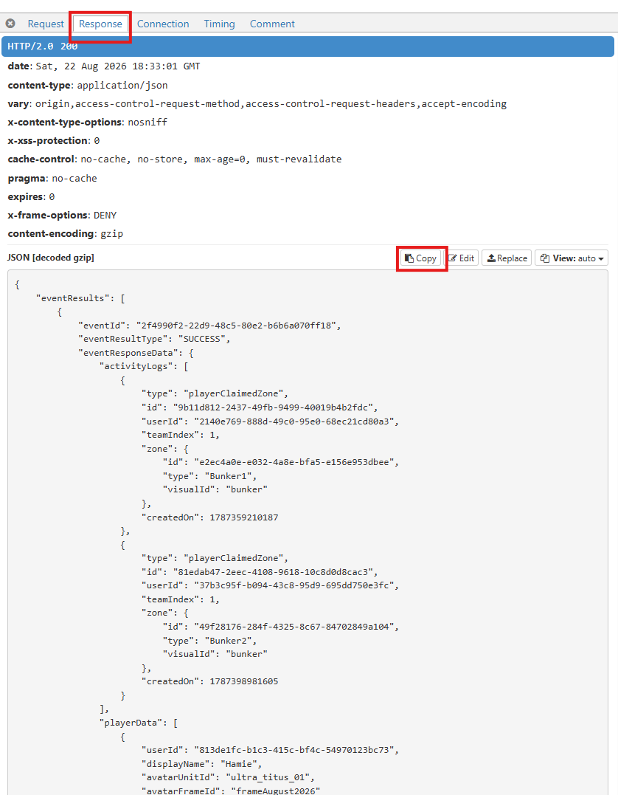

# Tacticus Guild Wars Dashboard

A Guild Wars analytics and team composition dashboard for the game *Praetorians of Terra*. Tracks live and historical guild-vs-guild war snapshots, player performance, battle logs, and team compositions.

## Pages

| Page | Description |
|------|-------------|
| `index.html` | Home overview with dataset selection |
| `guild-wars.html` | Guild Wars overview — token usage, battle performance, score projections |
| `battle-log.html` | Battle history with filters for result, player, team, and units |
| `guild-teams.html` | Team composition library and builder *(dev only)* |
| `player-page.html` | Per-player average attack/defense scores with scatter plots *(dev only)* |

## Data Structure

```
data/
├── dataset-manifest.json     # Index of all datasets (labels, sources, cache hash)
├── current/
│   └── live-war.json         # Active war snapshot
├── history/                  # Historical war snapshots (UUID-named)
└── static/
    ├── guild-teams.json      # Team composition library
    ├── portrait-map.json     # Unit ID → portrait image mapping
    └── image-manifest.json   # Available portrait images
```

Switch between datasets via the `?dataset=<key>` URL parameter.

## Scripts

```bash
# Generate dataset-manifest.json from data/history/
node scripts/generate-dataset-manifest.js

# Auto-map unit portraits from all snapshots
node src/auto-map-portraits.js

# Copy portrait images (Windows)
npm run copy:portraits
```

Or via npm:

```bash
npm run generate:datasets
npm run map:portraits
npm run copy:portraits
```

## Tests

Tests use the built-in `node:test` runner — no extra dependencies required.

```bash
node --test tests/
```

## Tech Stack

- Vanilla JavaScript (no frameworks)
- Tailwind CSS (CDN)
- Node.js for build scripts and tests

## Updating live war data

Instructions to update the data war the currently active war. Snowprint does not offer an API for war data Data has to be scraped from a live instance of tacticus.

### Inital setup

**1. Install Tacticus:** Download and install [Tacticus desktop add](https://hub.tacticusgame.com/download?source=web).
**2. Install mitmproxy:** Download and install [mitmproxy](https://www.mitmproxy.org/). This also include **mitmweb**.

### Turn on a proxy server

Whenever you want to scrap data you have to turn on a proxy server:

1. Open **Settings → Network & Internet → Proxy**.
2. Under *Manual proxy setup*, toggle **Use a proxy server** on.
3. Set Address to `127.0.0.1` and Port to `8080`, then click **Save**.

### Turn on mitmweb & filter tacticus data

Once mitmweb is running and the proxy is active:

1. Open command propmt with `Window key + R`.
2. Run the `mitmweb` command. If this command works, mitmweb will open a browser tab automatically.
```bash
mitmweb
```
### Find live war data

You should now be set up to extract the war data.

**1. log into tacticus desktop all**.
**2. navigate to Guilds -> Guild War -> War Status -> Activity**.





**3. In mitmweb you are looking for a path called `https://api-live.loki.snowprintstudios.com/game-event/game3/...` you are looking from a request type called "GET_GUILD_WAR_ACTIVITY_LOGS"**



**4. Open the response tab and copy the API response data**



### Save live war data

Save the JSON output from the scraped API responce to [live-war.json](tacticus-guild\data\current\live-war.json).

Commit and push back to master. A GitHub action will deploy the data to the live site.
